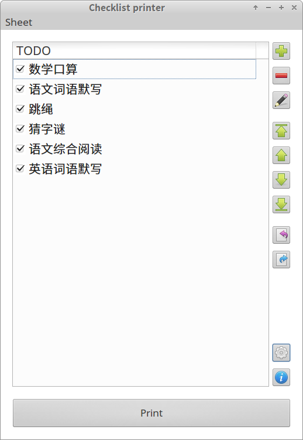
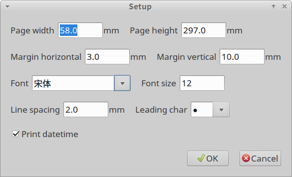

Checklist Printer
=================

A small toolkit that can check items from templates quickly and print.

小工具，从模板快速生成CheckList并打印，

Narrow-width heat sensitive printer is prefered.

推荐用热敏票据打印机。

Support localization, current English and Chinese.

支持本地化，英文和中文。

Use cases:

应用场景：

* assign daily work for kids

* 给小孩布置每天的功课列表

* shopping list

* 购物清单

Snapshots:

截图:

URL: <https://github.com/pengshulin/checklist_printer>

Peng Shulin <trees_peng@163.com> 2017

